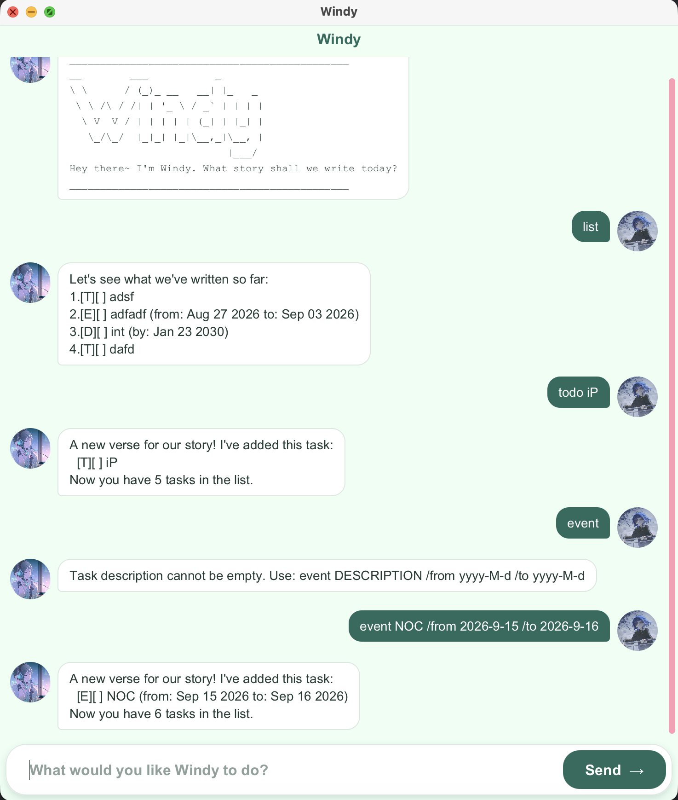

# Windy User Guide

Windy is a desktop task manager with a chat-style interface. Type a command to add tasks, track their progress, or find what needs attention.

## Quick start

1. Follow the [setup and launch instructions](../README.md#run-windy). Windy requires JDK 25.
2. Type a command in the input box and press Enter or click **Send**. Try `todo read a book` to add a task.
3. Type `list` to see your tasks. Use the number beside a task in commands such as `mark 1`.



See [Features](#features) for each command's details.

## Features

Notes about command formats:

- Words in `UPPER_CASE`, such as `DESCRIPTION` and `TASK_NUMBER`, are values you supply. For example, replace `DESCRIPTION` with `read a book`.
- Dates use `yyyy-M-d` (year-month-day). The month and day may have one or two digits: `2026-9-3` and `2026-09-03` are both valid.
- Task numbers start at 1 and refer to the full list shown by `list`. Search results do not create a new set of task numbers.

### Adding a to-do: `todo`

Adds a task without a date.

Format: `todo DESCRIPTION`

Example: `todo read a book` adds `[T][ ] read a book`.

### Adding a deadline: `deadline`

Adds a task due on a specific date.

Format: `deadline DESCRIPTION /by yyyy-M-d`

Example: `deadline return book /by 2026-10-15` adds `[D][ ] return book (by: Oct 15 2026)`.

### Adding an event: `event`

Adds a task that spans a date range. The start and end dates are both included; the end date cannot come before the start date.

Format: `event DESCRIPTION /from yyyy-M-d /to yyyy-M-d`

Example: `event school break /from 2026-8-27 /to 2026-9-3` adds `[E][ ] school break (from: Aug 27 2026 to: Sep 03 2026)`.

For all three task types, `[ ]` means incomplete and `[X]` means done. A description cannot contain `|`, which Windy reserves for its data file. Invalid calendar dates are rejected.

### Listing tasks: `list`

Shows all tasks in order, with the numbers used by `mark`, `unmark`, and `delete`.

Format: `list`

Example: After adding two tasks, `list` might show:

```text
1.[T][ ] read a book
2.[D][ ] return book (by: Oct 15 2026)
```

### Marking a task as done: `mark`

Changes a task's status from `[ ]` to `[X]`.

Format: `mark TASK_NUMBER`

Example: `mark 1` marks the first task in the full list as done.

### Marking a task as not done: `unmark`

Changes a task's status from `[X]` back to `[ ]`.

Format: `unmark TASK_NUMBER`

Example: `unmark 1` marks the first task as incomplete.

### Deleting a task: `delete`

Removes a task from the list. Later task numbers can change, so run `list` again before using another number.

Format: `delete TASK_NUMBER`

Example: `delete 2` removes the second task in the full list.

### Finding tasks by keyword: `find`

Finds task descriptions containing one keyword, regardless of completion status. Matching is case-insensitive and includes partial words.

Format: `find KEYWORD`

Example: `find book` finds tasks whose descriptions contain `book` or `Book`.

### Finding tasks by date: `date`

Shows incomplete deadlines due on or after the specified date and incomplete events whose date range includes that date. To-dos without dates and completed tasks are excluded.

Format: `date yyyy-M-d`

Example: `date 2026-9-3` includes an unfinished event running through 3 September and an unfinished deadline due later.

### Undoing a change: `undo`

Reverses the most recent task change made during the current run of Windy. This can be an addition, status change, or deletion.

Format: `undo`

Example: After `delete 2`, enter `undo` to restore the deleted task.

### Redoing a change: `redo`

Reapplies the change most recently reversed by `undo`. Windy keeps only one change in its undo/redo history; making a new task change replaces that history. Closing the app clears it.

Format: `redo`

Example: After undoing `delete 2`, enter `redo` to delete that task again.

### Exiting Windy: `bye`

Displays a farewell message and closes the app.

Format: `bye`

### Saving the data

Windy saves successful task changes automatically; no save command is needed. It loads tasks from `data/windy.txt` when it starts. This path is relative to the app's working directory, and the data file is ignored by Git. Avoid editing it while Windy is open.

## Command summary

| Action | Format | Example |
| --- | --- | --- |
| Add a to-do | `todo DESCRIPTION` | `todo read a book` |
| Add a deadline | `deadline DESCRIPTION /by yyyy-M-d` | `deadline return book /by 2026-10-15` |
| Add an event | `event DESCRIPTION /from yyyy-M-d /to yyyy-M-d` | `event school break /from 2026-8-27 /to 2026-9-3` |
| List tasks | `list` | `list` |
| Mark done | `mark TASK_NUMBER` | `mark 1` |
| Mark not done | `unmark TASK_NUMBER` | `unmark 1` |
| Delete | `delete TASK_NUMBER` | `delete 2` |
| Find by keyword | `find KEYWORD` | `find book` |
| Find by date | `date yyyy-M-d` | `date 2026-9-3` |
| Undo | `undo` | `undo` |
| Redo | `redo` | `redo` |
| Exit | `bye` | `bye` |
